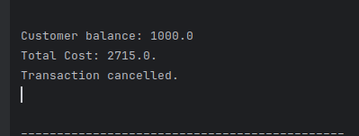
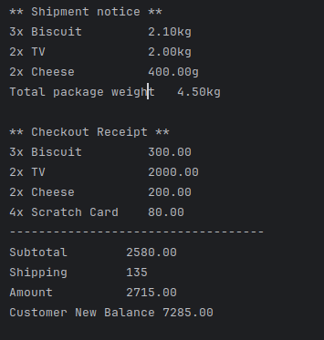
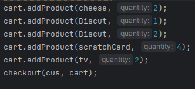

# E-Commerce-System
This project is a console-based E-Commerce System built in Java as part of the **Fawry Quantum Internship Challenge**. It simulates a shopping experience with product definitions, cart operations, checkout validation, and shipping logic.
##  Features
- Product Management
  - Expirable and non-expirable products
  - Shippable vs. non-shippable items
- Cart operations.
- Checkout system:
  - Validates balance, stock, and expiry
  - Prints subtotal, shipping cost, and receipt
- Shipping service:
  - Calculates shipping weight and fees
  - Prints shipment notice.
## Notes
- Shipping fee = `30 EGP per kg` (rounded)
## Test Scenarios

- ✅ Successful checkout
- ❌ Insufficient balance
- ❌ Expired items in cart
- ❌ Requesting more items than in stock
## Screenshots
### Not Enough Balance

### Enough Balance

### Test

